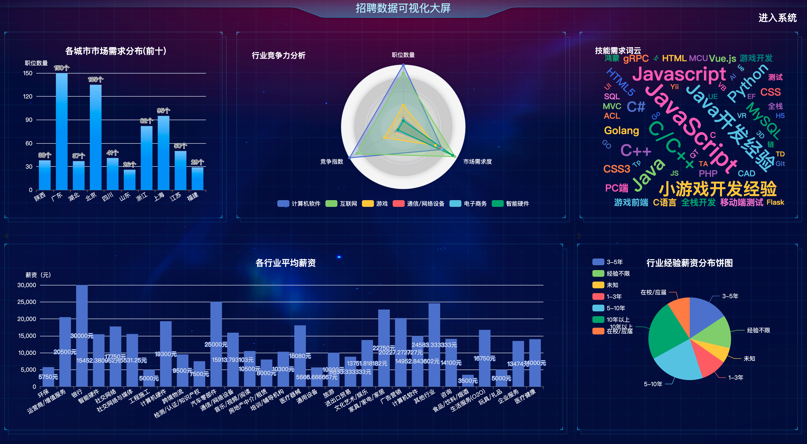
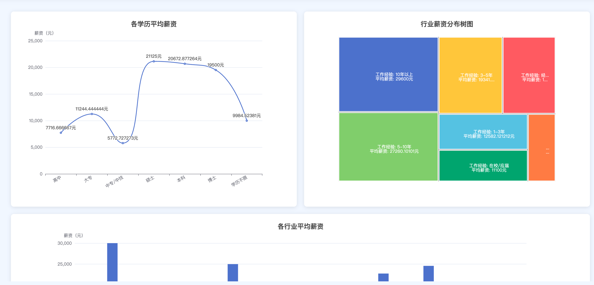
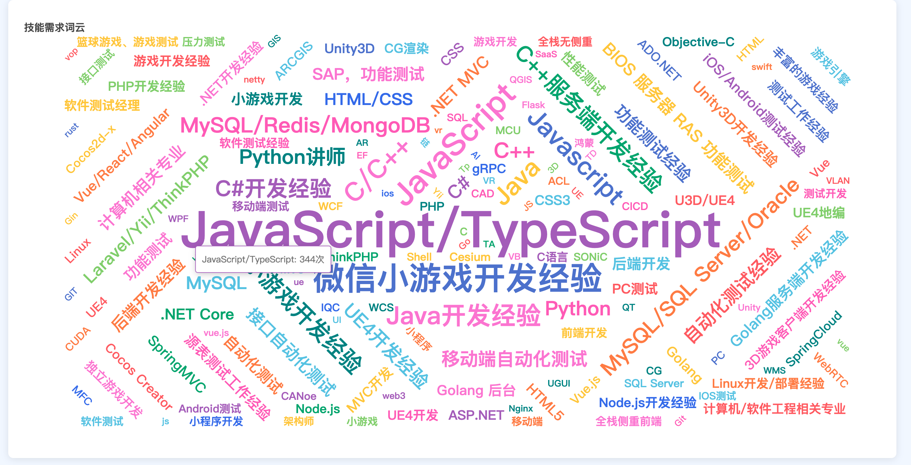
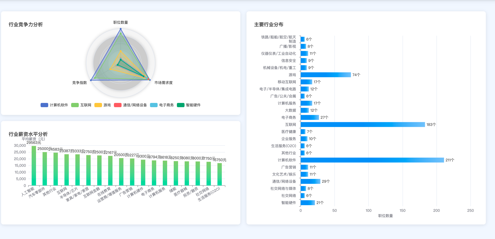
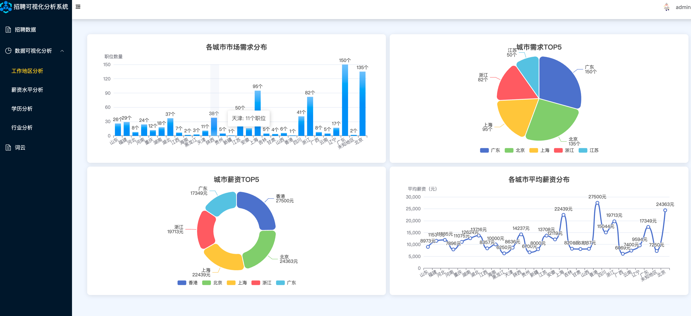

# 计算机毕业设计: Python, Spring Boot, Vue, ECharts 招聘可视化分析

## 项目简介
本项目旨在通过Python爬虫技术获取招聘数据，并使用Spring Boot作为后端框架，Vue作为前端框架，ECharts进行数据可视化分析，展示招聘市场的现状和趋势。

## 功能模块
1. **数据爬取**: 使用Python爬虫技术从招聘网站获取招聘数据。
2. **数据存储**: 将爬取的数据存储在数据库中，方便后续处理和分析。
3. **数据分析**: 使用Spring Boot和Vue进行数据处理和展示。
4. **数据可视化**: 使用ECharts将分析结果进行可视化展示。

## 技术栈
- **后端**: Spring Boot
- **前端**: Vue
- **数据可视化**: ECharts
- **爬虫**: Python

**源码有偿！一套(PPT 源码+sql脚本+教程)**
我的QQ号是1208505019或者 微信:IllIlIlllIIIllIlIlIl

## 项目截图

